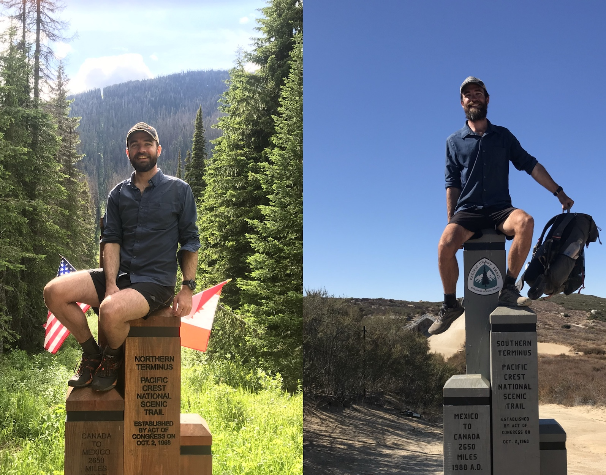

# Welcome!

You might be here because you're interested in some of my projects, or even better - you may be interested in hiring me!

## 🐙 Projects

I am currently working on Guide to the Clojure Programming Language aimed at Software Engineers. If you're interested in this, please see below:

* [Clojure for Software Engineers](https://github.com/mattmorten/clojure-tutorial)

I also maintain an online Guidebook to hiking the Pacific Crest Trail in a Southbound direction (Canada to Mexico):

* [Shrink's SOBO PCT Guide](https://shrinks.guide)

## 🐧 Hiring me

If you are in need of a Principal Engineer with...

* 15+ years in the tech industry
* Broad language knowledge (Java, Clojure, Golang, and JavaScript)
* Distributed, Scalable systems expertise 
* Experience building large IoT Cloud Platforms with Device-to-Cloud capability, and sandboxed code execution environments
* Knowledge of tuning the JVM to minimize transaction latency for Fintech products
* Great communication skills with the ability to work across teams and understand and translate business requirements

... then please consider hiring me! My [resume is available here](https://github.com/mattmorten/start-here/blob/main/Matthew%20Morten%20Resume%20-%20March%202022.pdf)

